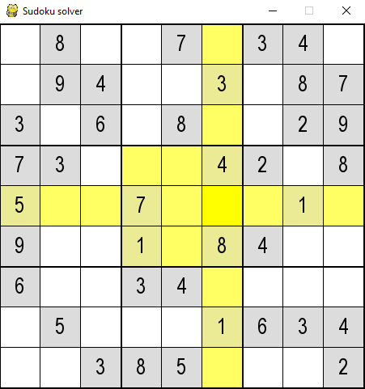

# sdku
Sudoku solver and generator with graphical interface.

## install

Requires [Pygame](http://www.pygame.org/news).

## usage

For now, at the end of the file, there are two lines, one commented.

    # s = DisplaySudoku(sudoku_from_matrix(matrix_from_string(libe)),
    #                   screen, case_size)

    s = DisplaySudoku(generate_long_sudoku(), screen, case_size)

By default, the program generates a new grid at launch (may take some time).
If you want to solve a specific one, just override the string var `libe` with your grid.
The syntax is row by row, one space when you don't know the number, one `\n` at the end.

Then you can press somes keys to perform actions:

key | action
--- | ---
`ESC` | Unselected all cases
`s` | Perform one step in resolution.
`d` | Solve grid.
`p` | Set possibilities in all cases.
`r` | Remove a random non-empty case.
`e` | Highlight errors.
`f` | Try for a second solution.
`g` | Save to a file (syntax is the same as the string input).

Furthermore, you can move around with the keyboard arrows, use the numpad to put your numbers, and `SHIFT` to note possibilities.
